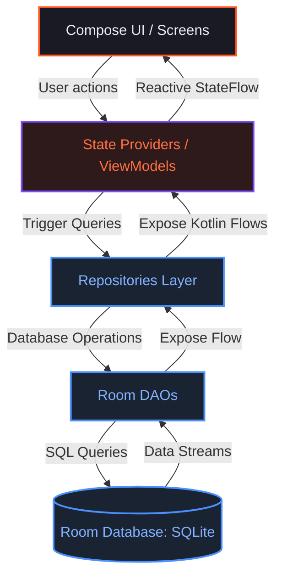
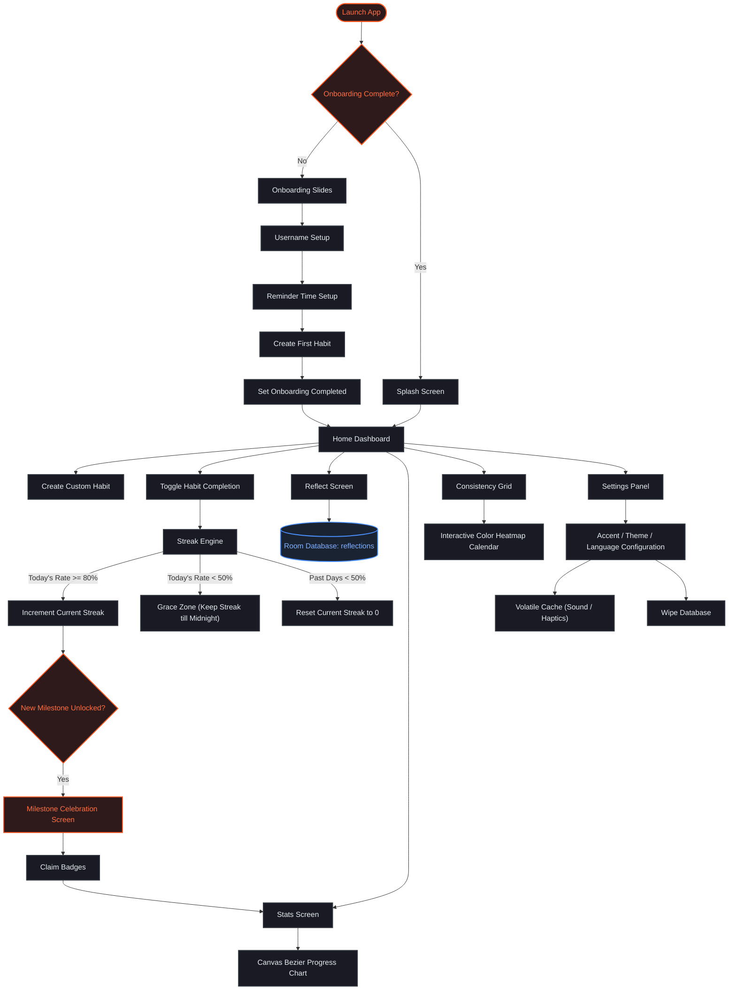

<div align="center">
  

  # 🎯 STREAKLY

  ### **A professional dark-themed daily streak & discipline tracking app.**

  *Built with Jetpack Compose, Material 3, and Room Database to keep you focused, disciplined, and accountable.*

  <p align="center">
    <a href="https://github.com/Sagar-Sonewane/Streakly/stargazers"></a>
    <a href="https://github.com/Sagar-Sonewane/Streakly/network/members"></a>
    <a href="LICENSE"></a>
    <a href="https://github.com/Sagar-Sonewane/Streakly/issues"></a>
    <a href="https://github.com/Sagar-Sonewane/Streakly/pulls"></a>
    <a href="https://github.com/Sagar-Sonewane/Streakly/commits"></a>
  </p>

  <p align="center">
    
    
    
  </p>
</div>

---

## 📖 Hero Section

### The Problem Streakly Solves
Most habit trackers suffer from the **"Retroactive Modification Loop."** Users forget to log a habit, miss a day, and then manually check off tasks for yesterday, the day before, or last week. This compromises data integrity, defeats the psychological pressure of habit building, and fosters cheating. 

**Streakly introduces strict chronological integrity.** It locks edit capability for past days completely. If you didn't complete your habits before midnight, your streak breaks—creating real discipline, accountability, and a true sense of achievement.

### Who is it for?
Streakly is designed for **developers, students, creators, and professionals** who need structure, focus, and daily accountability. It’s for individuals who want a distraction-free, zero-latency, beautiful space to measure their commitments without cloud noise, subscription prompts, or data-sharing concerns.

### Why Streakly Exists
We believe discipline is built through friction and rewards. Streakly uses:
*   **Sensory Cues:** Low-latency auditory and haptic feedback on completion to stimulate dopamine.
*   **Aesthetic Environments:** A gorgeous dark-first Material 3 glassmorphic design that matches modern development environments.
*   **No-Cheat Mechanics:** A streak audit engine built on strict mathematics, offering a "grace zone" but enforcing resets when thresholds are ignored.
*   **100% Client-Side Privacy:** Your habits, data, and reflections are kept safe in your local SQLite container.

---

## 📱 Screenshots

<div align="center">
  <table width="100%">
    <tr>
      <td width="33.3%" align="center">
        <p><b>Home & Habits</b></p>
        
      </td>
      <td width="33.3%" align="center">
        <p><b>Onboarding Welcome</b></p>
        
      </td>
      <td width="33.3%" align="center">
        <p><b>Habit Customization</b></p>
        
      </td>
    </tr>
    <tr>
      <td width="33.3%" align="center">
        <br/><p><b>Bezier Analytics & Badges</b></p>
        
      </td>
      <td width="33.3%" align="center">
        <br/><p><b>Consistency Grid</b></p>
        
      </td>
      <td width="33.3%" align="center">
        <br/><p><b>Settings</b></p>
        
      </td>
    </tr>
  </table>
  <p><i>Note: Add actual screenshots matching these filenames to the <code>assets/screenshots/</code> directory.</i></p>
</div>

---

## ⚡ Features

### 🛠️ Productivity & Habit Engine
*   **Granular Recurrence Rules:** Track habits that occur `daily`, `once` (one-off tasks), or `weekly` (with multi-selection for specific weekdays, e.g., Mondays & Wednesdays).
*   **The Streak Audit Engine:** Calculates streaks dynamically across all chronological history:
    *   **Streak Increment (>=80%):** You must complete 80% or more of your active daily tasks to progress your streak.
    *   **Grace Zone (50% - 79%):** Keeps your current streak active, but does not increment it (allows for recovery).
    *   **Streak Reset (<50%):** Drop below half of your daily commitments and your streak is reset to zero.
*   **Past-Day Read-Only Lock:** Previous days in the calendar are rendered in read-only mode to prevent retroactive tampering and maintain discipline.
*   **Smart Reminders:** Individual, custom push notification alarms scheduled locally on a per-habit basis.

### 📊 Analytics & Gamification
*   **Custom Bezier Efficiency Chart:** High-performance graph rendered using native Compose `Canvas` drawing. Displays a vertical Bezier area chart of your task completion rates over the last 7 days.
*   **At-a-Glance Metrics Grid:** Tracks your `Active Streak` (current run), `Longest Streak` (all-time peak), and `Total Days Completed` (aggregate efficiency).
*   **Heatmap Consistency Grid:** An interactive, color-intensity calendar grid that mirrors the GitHub contribution chart. Colors scale in opacity depending on your daily task completion percentages (0%, 1%-49%, 50%-79%, 80%-100%).
*   **Discipline Badges Board:** An automated reward system that unlocks badges based on active streak milestones:
    *   `Spark` (3 Days)
    *   `Warrior` (7 Days)
    *   `Flame Master` (10 Days)
    *   `Champion` (20 Days)
    *   `Elite` (50 Days)
    *   `Legendary` (100 Days)
*   **Fanfare celebrations:** Plays animated popup celebrations and distinct vibration patterns when milestones are crossed.

### 📝 Reflective Journaling
*   **Daily Mood Selector:** Record how your day went with high-fidelity, interactive emoticons (😞 *Low*, 😐 *Okay*, 🙂 *Good*, 🤩 *Epic*).
*   **Gratitude & Win Log:** A rich textbox to note down lessons learned, wins, or ideas.
*   **Scrollable Journal Feed:** A history log of previous reflections so you can inspect your emotional patterns alongside your efficiency statistics.

### 🎨 Settings & Personalization
*   **Dynamic Theme Modes:** Full support for Dark Theme, Light Theme, and System Default.
*   **Flexible Accent Palettes:** Switch the main color across 6 vibrant neon options: Neon Cyan, Electric Blue, Purple Pulse, Emerald Green, Sunset Orange, and Rose Pink.
*   **Sensory Controls:** Toggle button sounds and tactile haptic feedback independently.
*   **Dynamic Localizations:** Fully translated UI supporting English (`en`), Hindi (`hi`), and Marathi (`mr`) toggled dynamically without restarting the app.

---

## 🛠️ Tech Stack

| Component | Technology | Description |
| :--- | :--- | :--- |
| **Language** | [Kotlin](https://kotlinlang.org/) | 100% Kotlin codebase using modern coroutines and Flow streams |
| **Framework** | [Android SDK](https://developer.android.com/studio) | Target SDK 36 (Android 16), Compile SDK 36.1, Minimum SDK 24 (Android 7.0) |
| **UI Framework** | [Jetpack Compose](https://developer.android.com/jetpack/compose) | Fully declarative layout rendering with dynamic Material 3 components |
| **Local Database** | [Room Database](https://developer.android.com/training/data-storage/room) | SQLite abstraction layer with KSP code generation and Flow streams |
| **Navigation** | [Navigation Compose](https://developer.android.com/guide/navigation/navigation-principles) | Type-safe declarative layout routing with enter/exit transition animations |
| **Scheduling** | [AlarmManager & Broadcasts](https://developer.android.com/training/scheduling/alarms) | Core Android system alarms to dispatch scheduled notifications reliably |
| **Image Loading** | [Coil](https://coil-kt.github.io/coil/) | Lightweight asynchronous image loading for Compose |
| **Parser / Serializer**| [Moshi](https://github.com/square/moshi) | JSON serialization for database migrations and lists |
| **Gradle / Build** | [Gradle Kotlin DSL](https://docs.gradle.org/current/userguide/kotlin_dsl.html) | Modern dependencies block configuration utilizing Version Catalogs (`libs.versions.toml`) |
| **Security/Secrets**| [Secrets Gradle Plugin](https://github.com/google/secrets-gradle-plugin) | Safe retrieval of environment variable placeholders |

---

## 📂 Folder Structure

```text
streakly/
├── .env.example                               # Environment configuration template
├── README.md                                  # Repository documentation
├── app-release.apk                            # Precompiled production APK
├── my-upload-key.jks                          # Production signing key container
├── build.gradle.kts                           # Root Gradle project configuration
├── settings.gradle.kts                        # Gradle sub-project settings
├── gradle/                                    # Gradle wrapper and version catalog
│   └── libs.versions.toml                     # Centralized dependency catalog
└── app/
    ├── build.gradle.kts                       # App modules Gradle settings
    ├── proguard-rules.pro                     # Release shrinker optimizations
    └── src/
        └── main/
            ├── AndroidManifest.xml            # App permissions and component declaration
            ├── java/com/example/
            │   ├── StreaklyApp.kt             # Application init, DB setup, migrations
            │   ├── MainActivity.kt            # Single Activity entry point
            │   ├── core/                      # Application core utilities
            │   │   ├── constants/             # Global configurations and quote pool
            │   │   ├── theme/                 # Custom HSL-based colors and typography
            │   │   └── utils/                 # Audio, haptics, and alarm receivers
            │   ├── data/                      # Database structure and models
            │   │   ├── database/              # Room database wrapper and SQL DAOs
            │   │   ├── models/                # Entity data classes
            │   │   └── repositories/          # Clean abstraction for database queries
            │   ├── navigation/                # Transition routing and Screen routes
            │   ├── providers/                 # State controllers (ViewModel equivalents)
            │   ├── shared/widgets/            # Reusable custom Compose components
            │   └── ui/                        # Compose layouts and screens
            │       ├── screens/               # Main pages, sheets, and onboarding
            │       └── theme/                 # Default Material 3 styling fallbacks
            └── res/                           # Android static resources
                ├── raw/                       # Audio assets (ogg)
                ├── values/                    # Themes and default app title strings
                └── xml/                       # App backup rules and file provider settings
```

---

## 💻 Project Architecture

Streakly uses a clean **Data-Repository-Provider (MVVM Variant)** architecture. Data flows unidirectionally from the Room database up to the user interface via reactive flows.



*   **UI Layer (`com.example.ui` & `shared`):** Completely declarative Compose layouts. Screens collect from State Providers and translate variables dynamically depending on settings.
*   **State Layer (`com.example.providers`):** Custom state providers (`TaskProvider`, `StreakProvider`, `ReflectionProvider`, `SettingsProvider`) extend `ViewModel` and scope coroutines to `viewModelScope`. They aggregate data, trigger updates, and manage UI flags.
*   **Data & Repositories Layer (`com.example.data`):**
    *   **`AppDatabase`:** The underlying SQLite manager running on Version 5.
    *   **DAOs:** Modular interfaces defining Room operations with Kotlin `Flow` support.
    *   **Repositories:** Simple access layers isolating DB interactions from the Compose layer.
*   **Core Utilities (`com.example.core.utils`):** Decoupled engines supporting alarms, exact notification boot restorations, custom haptics, and SoundPool audio players.

---

## 🚀 Application Flow

The interactive life cycle of the application is designed to onboard the user smoothly and then keep them in a disciplined daily feedback loop.



---

## 🚀 Installation & Build

### Prerequisites
1.  Install [Android Studio](https://developer.android.com/studio) (Ladybug or newer recommended).
2.  Install Android SDK Platform 36 and matching Build Tools.
3.  Ensure Java Development Kit (JDK) 17 is configured.

### Build and Run Steps

1.  **Clone the Repository:**
    ```bash
    git clone https://github.com/Sagar-Sonewane/Streakly.git
    cd Streakly
    ```

2.  **Configure Environment Variables:**
    Create a `.env` file in the project's root folder based on the example template:
    ```bash
    cp .env.example .env
    ```
    *(Note: Set your `GEMINI_API_KEY` placeholder inside the file. It is injected into BuildConfig by the Secrets Gradle Plugin).*

3.  **Compile & Run via Command Line:**
    To build the debug APK:
    ```bash
    ./gradlew assembleDebug
    ```
    To install the application onto a connected emulator or test device:
    ```bash
    ./gradlew installDebug
    ```

4.  **Open in Android Studio:**
    *   Select **Open** and target the root `Streakly` directory.
    *   Allow Gradle to synchronize dependencies.
    *   Click **Run** (green triangle) to compile and launch.

5.  **Direct Installation:**
    If you do not have Android Studio installed, you can copy the precompiled production APK `app-release.apk` located at the root of the project directly to your Android device and install it.

---

## 🔑 Environment Variables

Streakly uses the **Secrets Gradle Plugin** to load configuration variables into the `BuildConfig` file at compile time.

| Variable | Description | Required | Default / Example |
| :--- | :--- | :--- | :--- |
| `GEMINI_API_KEY` | Placeholder for Google Gemini API key to enable AI coaching features. | No (Optional) | `AIzaSyB_PlaceholderKey...` |
| `KEYSTORE_PATH` | Filepath to the custom release key database file (.jks). | No | `${rootDir}/my-upload-key.jks` |
| `STORE_PASSWORD` | Password of the release key repository. | No | `android` |
| `KEY_PASSWORD` | Password for the release alias key. | No | `android` |

*Do NOT check your custom `.env` file containing real secret keys into source control.*

---

## 📖 Usage Guide

### 1. Launch & Setup
When launched for the first time, you are presented with a premium horizontal onboarding slide deck:
*   Add your username (stored in shared preferences).
*   Grant push notifications permission.
*   Configure your global reminders check-in time (e.g., 07:00 AM).
*   Create your first starter habit to initialize your SQLite database.

### 2. Managing Habits
On the **Home** tab:
*   Tap the dynamic **Streak FAB** (`+` button) to expand the Creation sheet.
*   Customize your habit: title, descriptive notes, target time, frequency rules, importance level (colors highlight priority), and custom emojis.
*   Toggle reminders: configure exact alarm notification hours/minutes.
*   Complete a habit by tapping the card on the Home dashboard to trigger success sounds and haptics.

### 3. Streak Calculations & Rules
Your streak is audited daily:
*   Check off **80% or more** of today's tasks to advance your streak.
*   Between **50% and 79%**, your streak goes into a "Grace Zone"—it does not break, but it does not increment.
*   Falling **below 50%** resets your current active run back to zero.
*   You cannot edit previous calendar dates. Past days are locked in read-only mode, keeping you accountable.

### 4. Journaling Reflections
On the **Reflect** tab:
*   Choose one of 4 mood check-ins (Epic, Good, Okay, Low).
*   Write down notes, lessons, and thoughts.
*   Tap **Save Reflection** to store your daily journal.
*   Scroll through the Journal Feed below to review previous days.

### 5. Reviewing Analytics
*   On the **Stats** tab, check your Active, Longest, and Total completed days.
*   Inspect your efficiency trend with the Canvas Bezier curve chart.
*   Claim badges (Spark, Warrior, Flame Master, etc.) when your active streak unlocks them.
*   On the **Heatmap** tab, tap any calendar block in the consistency grid to see the exact habits you tracked and completed on that date.

---

## 🧩 Key Modules & Classes

### 📡 Data Providers & State Engine
*   **[`TaskProvider`](file:///d:/sagar/streakly/app/src/main/java/com/example/providers/TaskProvider.kt):** Merges the tasks database flow with the daily completion logs flow to generate active lists. Coordinates notifications and forces database recalculations.
*   **[`StreakProvider`](file:///d:/sagar/streakly/app/src/main/java/com/example/providers/StreakProvider.kt):** Implements the core mathematical streak logic. Traverses daily records from your first day to today, checks threshold compliance, and handles badge unlock events.
*   **[`ReflectionProvider`](file:///d:/sagar/streakly/app/src/main/java/com/example/providers/ReflectionProvider.kt):** Handles saving and purging daily mood entries and self-reflection notes.
*   **[`SettingsProvider`](file:///d:/sagar/streakly/app/src/main/java/com/example/providers/SettingsProvider.kt):** Controls theme states, dynamic language codes, sound toggles, and provides cached companion variables for swift sound and vibration lookups.

### 🔔 Broadcast Receivers & Scheduling
*   **[`ScheduledNotificationBootReceiver`](file:///d:/sagar/streakly/app/src/main/java/com/example/core/utils/ScheduledNotificationBootReceiver.kt):** Listens to `BOOT_COMPLETED` intents to reschedule daily reminders automatically if the device restarts.
*   **[`ScheduledNotificationReceiver`](file:///d:/sagar/streakly/app/src/main/java/com/example/core/utils/ScheduledNotificationReceiver.kt):** Listens to custom intent alarms to fire daily reminder notifications.
*   **[`TaskNotificationReceiver`](file:///d:/sagar/streakly/app/src/main/java/com/example/core/utils/TaskNotificationReceiver.kt):** Dispatches target push alerts for individual habit items.
*   **[`NotificationHelper`](file:///d:/sagar/streakly/app/src/main/java/com/example/core/utils/NotificationHelper.kt):** Interface layer to `AlarmManager` for scheduling and cancelling exact notifications.

### 🔊 Feedback Services
*   **[`SoundService`](file:///d:/sagar/streakly/app/src/main/java/com/example/core/utils/SoundService.kt):** Pre-loads low-latency `.ogg` clips using `SoundPool` for immediate completion sounds. Falls back to system AudioManager keypress standard effects for UI clicks.
*   **[`HapticService`](file:///d:/sagar/streakly/app/src/main/java/com/example/core/utils/HapticService.kt):** Targets Android's vibration API. Dispatches tick, click, double-click, and custom waveform vibrations on completion, deletions, error dialogs, and milestone unlocks.

---

## 🎨 Design Philosophy

*   **Low-Fatigue Dark Aesthetic:** Deep background tones (`#12121A`) with glassmorphic cards, custom borders, and dynamic neon accent themes.
*   **Micro-Animations:** Fluid transitions, responsive button scaling, and bouncy spring physics on swipe menus.
*   **Accountability Friction:** Designed with intentional constraints. If you skip tracking or fall behind, the app does not allow retro-fixes. Hard rules reinforce real habits.
*   **High Contrast Typography:** Clean type scales featuring Outfit/Inter-inspired typography hierarchies, utilizing semantic colors for clarity (priority is marked with hot pink-red, regular with calm blue).

---

## ⚡ Performance Optimizations

*   **Reactive Flow Pipelines:** Uses Room's native SQLite `Flow` integration. Database changes immediately propagate to providers, filtering lists in memory and avoiding redundant query cycles.
*   **Zero-Latency Audio Pipeline:** Loads audio assets (`task_complete.ogg`, `task_remove.ogg`, `task_add.ogg`, `notification.ogg`) into memory at application boot using `SoundPool`, avoiding disk read latency on completion clicks.
*   **Direct Canvas Graphs:** Rendered directly using Compose `Canvas` drawing nodes rather than loading heavy external charting libraries, keeping the APK footprint small (~13MB).
*   **Volatile Settings Cache:** Global sound/haptics toggle configurations are mirrored in volatile companion variables, avoiding disk-bound SharedPreference read latency when triggering fast haptic clicks in list rows.
*   **Density Independent Scaling:** Custom responsive viewport utilities (`Responsive.h`, `Responsive.sp`, `Responsive.fp`) that scale margins, paddings, and font sizes dynamically according to the device's screen size.

---

## 🔒 Security & Privacy

*   **No Remote Access / Fully Offline:** Streakly does not request network access permissions. Your records, settings, and journal entries are kept inside the local database on your device.
*   **Permission Isolation:** Requests only the narrowest Android system permissions (`VIBRATE`, `POST_NOTIFICATIONS`, `RECEIVE_BOOT_COMPLETED`, and `USE_EXACT_ALARM`).
*   **Data Control:** Includes a database wipe button on the Settings screen, giving you full control to erase all records.

---

## 🗺️ Roadmap

- [x] Initial Onboarding & profile initialization
- [x] Room database local records store
- [x] Multi-lingual dynamic translations (English, Hindi, Marathi)
- [x] 6-color custom accent themes
- [x] Tactile haptic feedback and SoundPool completion clips
- [x] Custom vertical Bezier 7-day progress charts
- [x] Color-intensity heatmap consistency calendar grid
- [x] Exact alarm notification alarms engine (`AlarmManager` & receivers)
- [ ] Server-Side cloud sync (Supabase / WebDAV database backup support)
- [ ] AI Coaching Feed (Gemini AI parsing reflections to offer weekly habits feedback)
- [ ] WearOS companion application for smartwatch check-ins
- [ ] Android Home Screen widgets for one-click habit completions

---

## 🤝 Contributing

Contributions are what make the open-source community such an amazing place to learn, inspire, and create. Any contributions you make are **greatly appreciated**.

1.  Fork the Project
2.  Create your Feature Branch (`git checkout -b feature/AmazingFeature`)
3.  Commit your Changes (`git commit -m 'Add some AmazingFeature'`)
4.  Push to the Branch (`git push origin feature/AmazingFeature`)
5.  Open a Pull Request

---

## 📄 License

Distributed under the MIT License. See `LICENSE` placeholder below:

```text
Copyright (c) 2026 Sagar Sonewane

Permission is hereby granted, free of charge, to any person obtaining a copy
of this software and associated documentation files (the "Software"), to deal
in the Software without restriction, including without limitation the rights
to use, copy, modify, merge, publish, distribute, sublicense, and/or sell
copies of the Software, and to permit persons to whom the Software is
furnished to do so, subject to the following conditions:

The above copyright notice and this permission notice shall be included in all
copies or substantial portions of the Software.

THE SOFTWARE IS PROVIDED "AS IS", WITHOUT WARRANTY OF ANY KIND, EXPRESS OR
IMPLIED, INCLUDING BUT NOT LIMITED TO THE WARRANTIES OF MERCHANTABILITY,
FITNESS FOR A PARTICULAR PURPOSE AND NONINFRINGEMENT. IN NO EVENT SHALL THE
AUTHORS OR COPYRIGHT HOLDERS BE LIABLE FOR ANY CLAIM, DAMAGES OR OTHER
LIABILITY, WHETHER IN AN ACTION OF CONTRACT, TORT OR OTHERWISE, ARISING FROM,
OUT OF OR IN CONNECTION WITH THE SOFTWARE OR THE USE OR OTHER DEALINGS IN THE
SOFTWARE.
```

---

## ✍️ Author

**Sagar Sonewane**
*   **GitHub:** [@Sagar-Sonewane](https://github.com/Sagar-Sonewane)
*   **LinkedIn:** [Sagar Sonewane](https://www.linkedin.com/in/sagar-sonewane-/)
*   **Portfolio:** [Sagar Sonewane Portfolio](https://github.com/Sagar-Sonewane)
*   **Email:** [sagar.sonewane@example.com](mailto:sagar.sonewane@example.com)

---

## 💖 Support

If you like this project, please consider giving it a star!

*   ⭐ Star this repository to help others find it.
*   🍴 Fork it to start building your own version.
*   🐞 Report issues or suggest new features in the issues tab.
*   💡 Request new features or submit improvements via Pull Requests.
